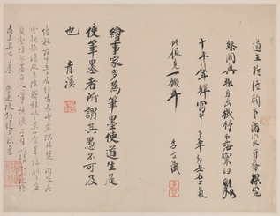

# Web & App Development
## Bruce Provencher
### Markdown Practice



Link to [Amazon.com](https://wwww.amazon.com).

Learn about Python [variables](https://youtu.be/LKFrQXaoSMQ?feature=shared) on YouTube.

```
first_name = 'Bruce'
last_name = 'Provencher'
print(f'My name is {first_name} {last_name}.')
```

## About Me
**In my free time, I like to go hiking and camping.**

*My wife and I have four cats -- Aurora, Kira, Sepp and Jasper.*


